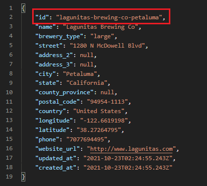

# MA-challenge-UI and API

### :round_pushpin: Test FRONTEND

Para el desarrollo de los test Frontend se utilizó lo siguiente

* Java
* Selenium WebDriver
* TestNG
* Maven
* IntelliJ
* Patron POM (Page Object Model)

### :small_blue_diamond: Considereciones

* Chromedriver (src/main/resources)

### :small_blue_diamond: Ejecución test 

* Opcion 1: Comando Maven
 
``` mvn  test -Dtest='org.jonathanbs.ui.TestUIMercantil' ```

* Opcion 2: De forma manual en la clase TetUIMercantil


### :small_blue_diamond: Generación de Reporte

* Si los test fueron realizados mediante comando maven, el reporte se generará en:

`` target/surefire-reports/index.html `` 

* Si los test fueron corridos de forma manual, se crea una carpeta 'test-output'

`` test-output/index.html  ``


### :round_pushpin: Test BACKEND 


Para el desarrollo de los test Backend se utilizó lo siguiente

* Java
* RestAssured
* TestNG
* Maven
* IntelliJ
* POJO (Plain old Java Object)

### :small_blue_diamond: Ejecución de test

* Comando Maven

`` mvn  test -Dtest='org.jonathanbs.api.BrewingApi.BrewingTests' ``


### :small_blue_diamond: Generación de Reporte

* Si los test fueron realizados mediante comando maven, el reporte se generará en:

`` target/surefire-reports/index.html ``

* Si los test fueron corridos de forma manual, se crea una carpeta 'test-output'

`` test-output/index.html  ``

* Observaciones: En este caso el test falla, ya que el id=761 no coincide con el id de la respuesta.



